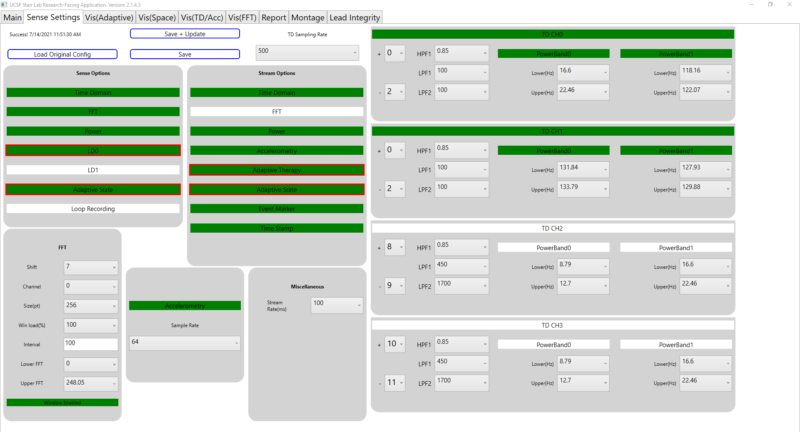
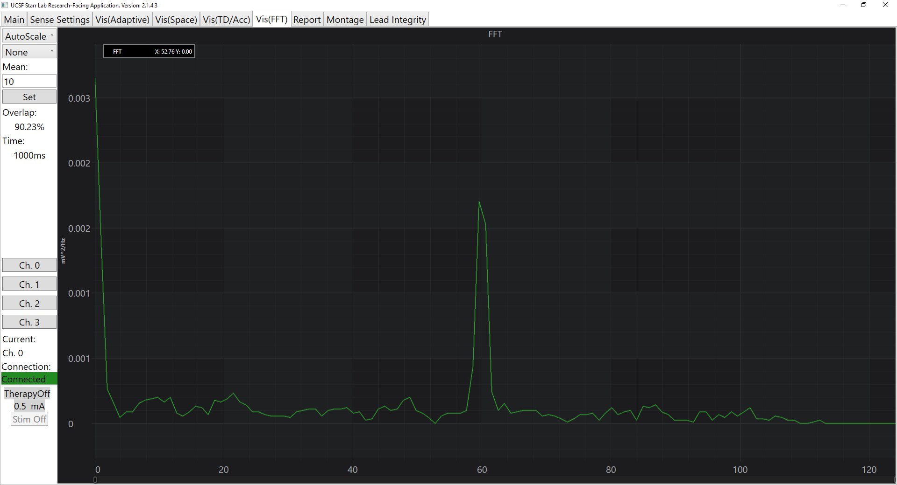

# UCSF Research Application

### Introduction 
This research application is built for connection with RC+S and is intended for use in-clinic in a supervised manner. It is provided "as-is" and use in your protocol depends on risk assessment and IDE details. The application provides a GUI (graphical user interface) to control streaming, stimulation and configuration of embedded aDBS (adaptive deep brain stimulation) in the RC+S within predefined limits set by the clinician programmer (also referred to as RLP). Some of the main capabilities of this program: 

## Key Features: 

	* Configure sensing parameters for time domain, built in FFT and built in power domain signals.
	* Real time visualization of time domain, power domain, FFT signal, and Linear detectors
	* Change stimulation parameters (via GUI) for all programs (within pre-defined limits): amplitude, rate, pulse width. Turn stimulation on/off, change groups etc. 
	* Via an easily configure text file, control a "report" that will send down events into RC+S.
	* Mechanisms for syncing external sensors via pre-configured stimulation trains or external inputs. 
	* Montage titration: ability (via configurable text based `json` files) to run through different sensing paramters. 
	* Stimulation titration: ability (via configurable text based `json` files) to programtically run through different stimluation parameters. 
	* Lead integrity: checking impedences. 
	
Installation instructions are below, as well as more details about each "screen" of the application on it's main features. 

### Video Tutorials

[Setup Instructions Walkthrough](https://ucsf.box.com/s/uhpknjepmh4mibi9i9ssyxl0w6hp6gwk)

[Config File Walkthrough](https://ucsf.box.com/s/gfx8f61u3nd0x9hyqhg7c9l6n93teb51)

[Application Walkthrough](https://ucsf.box.com/s/yre8fj2743iz9h7ubmzf41pd0kjnwekx)

[Sense/Stim Montage Setup and Walkthrough](https://ucsf.box.com/s/zi4q1wrnivda5vfg5834e4yh4dmn66bd)


### Main Screen
Main screen shows that you can turn stim on/off, change stim amp/rate/pulse width, change groups/programs, turn stream on/off, turn embedded adaptive on/off/update, and align to align with an external device. You can connect to a specific ctm or unchecked box will connect to first ctm found. New Session starts a new session directory for the Medtronic .json files for a fresh set of files. Mode/ratio allows you to change signal bandwidth and packets up/down.


### Sense Settings
Sense Settings screen allows you to adjust the sense parameters. When making a change that is not saved, the border will highlight red. After saving is complete the border will unhighlight. If you save and update it will update visualization screens, whereas save will save the file without updating the visualization screens.


### Adaptive Visualization
Adaptive Vis screen allows you to visualize 2 different power bands along with linear detector 0 and 1 and the upper and lower thresholds. The detectors are on a y axis together(right side) with the thresholds and the both power bands are on thier own y axis (left side). Choose which powerband to visualize from with the drop down menu. Pink is Power 1 and yellow is Power 2. 
The state and current visualization are each on their own y axes and show all 4 programs at once. You may choose to turn off any chart series that you are not using. 
You can change the visualization of the power/detector visualization using dropdown menu to make them auto-scale, view the thresholds(sets the thresholds inside the screen as shown in image) and none (which will allow the user to adjust themselves by pulling the side axes bars). You can also change the amount of data points shown.


### State Space Visualization
When running adaptive, the state space will plot Power 1 from the dropdown menu selected in pink in the Vis(Adaptive) tab on the x axis and Power 2 from the dropdown menu selected in yellow in the Vis(Adaptive) tab on the y axis. You also have the ability to update the weights, thresholds, FFPV and update rate directly to the adaptive_config.json (pressing the aDBS On/Update is required after making the changes)


### FFT Visualization
FFT Vis screen allows you to view the fft data. You may view the auto scale (as shown in image), the log10 of the points, and none which allows you to adjust it yourself.  You can choose which time domain channel you would like to visualize from. You can also set the mean which will average the number of fft samples coming in. Setting it to 1 will not do any averaging.


### Report Screen
Report screen allows you to log events in the Medtronic .json eventLog.json file. You may change the symptom/medication fields with a configuration file. Reporting will log down the checked symptoms, medications and any additional information you provide by typing text into the box. The medication time can also be added and will be logged. Once finished, you may click reset to uncheck boxes and clear text from the box.


### Montage Screen
Montage screen allows you to run a montage of different sense configurations. It essentially loads up different pre-defined sense configurations and runs each for a specific amount of time.
Stim sweep allows you to run different groups, stim amp/rate/pw for a specific amount of time for each run. 


### Lead Integrity Screen
Lead Integrity screen allows you to run a lead integrity test on all the contacts. You can change the case, but the default is 16. 


## Installation

### Step 1: Add config files
There are 3 config files needed for the application, the sensing configurations and another for reporting conditions/medications.  All of these files need to go into the directory *C:\AdaptiveDBS* and must be named application_config.json, sense_config.json and report_config.json, respectively.  
** NOTE: You may also copy the config files from the location and put the in the correct directory: [Config Files](https://github.com/openmind-consortium/App-aDBS-ResearchFacingApp/tree/master/EmbeddedAdaptiveDBSApplication/bin/x64/Release/Auto_Update_Report/current_config_files)

The sense_config.json template file is:
```
{
	"eventType": {
		"comment": "event name to use to log to .json files",
		"type": "Home streaming"
	},
	"Mode": 4,
	"Ratio": 4,
	"SenseOptions": {
		"comment": "lets you set what to sense",
		"TimeDomain": true,
		"FFT": true,
		"Power": true,
		"LD0": true,
		"LD1": false,
		"AdaptiveState": true,
		"LoopRecording": false,
		"Unused": false
	},
	"StreamEnables": {
		"comment": "lets you set what to stream",
		"TimeDomain": true,
		"FFT": false,
		"Power": true,
		"Accelerometry": true,
		"AdaptiveTherapy": true,
		"AdaptiveState": true,
		"EventMarker": false,
		"TimeStamp": false
	},
	"Sense": {
		"commentTDChannelDefinitions": "No more than two channels can be on a single bore. When configuring, channels on first bore will always be first. Can only have sampling rates of: 250, 500, and 1000 (Hz) or disable it by setting IsDisabled to true",
		"commentFilters": "Stage one low pass(Lpf1) can only be: 450, 100, or 50 (Hz). Stage two low pass(Lpf2) can only be: 1700, 350, 160, or 100 (Hz). High pass(Hpf) can only be: 0.85, 1.2, 3.3, or 8.6 (Hz), Inputs[ anode(positive), cathode(negative) ], tdEvokedResponseEnable can either be 0 for standard, 16 for evoked 0 or 32 for evoked 1",
		"TDSampleRate": 250,
		"TimeDomains": [
			{
				"IsEnabled": true,
				"Hpf": 0.85,
				"Lpf1": 100,
				"Lpf2": 100,
				"Inputs": [
					0,
					2
				],
				"TdEvokedResponseEnable": 0
			},
			{
				"IsEnabled": true,
				"Hpf": 0.85,
				"Lpf1": 100,
				"Lpf2": 100,
				"Inputs": [
					0,
					2
				],
				"TdEvokedResponseEnable": 0
			},
			{
				"IsEnabled": false,
				"Hpf": 0.85,
				"Lpf1": 450,
				"Lpf2": 1700,
				"Inputs": [
					8,
					9
				],
				"TdEvokedResponseEnable": 0
			},
			{
				"IsEnabled": false,
				"Hpf": 0.85,
				"Lpf1": 450,
				"Lpf2": 1700,
				"Inputs": [
					10,
					11
				],
				"TdEvokedResponseEnable": 0
			}
		],
		"FFT": {
			"commentFFTParameters": "FFT Size can be: 64, 256, or 1024 samples, Hanning window load can be: 25, 50, or 100 (%), channel is for the fft channel must be between 0-3 and time domain must be enabled for that channel, WeightMultiplies can be shift: 0-7",
			"Channel": 0,
			"FftSize": 256,
			"FftInterval": 100,
			"WindowLoad": 100,
			"StreamSizeBins": 0,
			"StreamOffsetBins": 0,
			"WindowEnabled": true,
			"WeightMultiplies": 7
		},
		"commentPower": "each power band can be set from 0-250hz, 2 pos bands per channel. Ex: ChNPowerBandN:[lower, upper]",
		"PowerBands": [
			{
				"comment": "Channel: 0 PowerBand: 0",
				"ChannelPowerBand": [
					17.09,
					22.95
				],
				"IsEnabled": true
			},
			{
				"comment": "Channel: 0 PowerBand: 1",
				"ChannelPowerBand": [
					117.68,
					121.58
				],
				"IsEnabled": true
			},
			{
				"comment": "Channel: 1 PowerBand: 0",
				"ChannelPowerBand": [
					123.54,
					124.51
				],
				"IsEnabled": true
			},
			{
				"comment": "Channel: 1 PowerBand: 1",
				"ChannelPowerBand": [
					123.54,
					124.51
				],
				"IsEnabled": true
			},
			{
				"comment": "Channel: 2 PowerBand: 0",
				"ChannelPowerBand": [
					8.3,
					13.18
				],
				"IsEnabled": false
			},
			{
				"comment": "Channel: 2 PowerBand: 1",
				"ChannelPowerBand": [
					17.09,
					22.95
				],
				"IsEnabled": false
			},
			{
				"comment": "Channel: 3 PowerBand: 0",
				"ChannelPowerBand": [
					8.3,
					13.18
				],
				"IsEnabled": false
			},
			{
				"comment": "Channel: 3 PowerBand: 1",
				"ChannelPowerBand": [
					17.09,
					22.95
				],
				"IsEnabled": false
			}
		],
		"Accelerometer": {
			"commentAcc": "Can be 4,8,16,32,64Hz or set SampleRateDisabled to true for disabled",
			"SampleRateDisabled": false,
			"SampleRate": 64
		},
		"Misc": {
			"commentMiscParameters": "stream rate can be 30-100 by tens and is in ms; LoopRecordingTriggersState can be 0-8 or can be disabled by changing IsEnabled to false; Bridging can be 0 = None, 1 = Bridge 0-2 enabled, 2 = Bridge 1-3 enabled",
			"StreamingRate": 100,
			"LoopRecordingTriggersState": 0,
			"LoopRecordingTriggersIsEnabled": true,
			"LoopRecordingPostBufferTime": 53,
			"Bridging": 0
		}
	}
}
```

The report_config.json template file is:
```
{
	"comment": "List of medications and symptoms for Report Window to user. You may add more or less medications and symptoms as you like.",
	"Medications": [
		"1 x medicationA",
		"2 x medicationB"
	],
	"Symptoms": [
		"Feeling 'on' little / no symptoms",
		"Balance and posture",
		"Slowness of Movement",
		"Dyskinesia",
		"Dystonia",
		"Rigidity (Muscle Stiffness)",
		"Speech",
		"Tremor",
		"Mania",
		"Inappropriate Sleepiness"
	]
}
```

And the application config template is:
```
{
	"comment": "BasePathToJSONFiles is where the files to the medtronic json files are stored. Must match the registry edit file.  	CTMBeepEnables allows beeps to be turned on. If LogBeepEvent is true, an event will be logged when there is sound in the mic over a certain decibal. This allows an outside hardware device to send a beep in and sync to the INS",
	"BasePathToJSONFiles": "C:\\ProgramData\\Medtronic ORCA",
	"LogBeepEvent": true,
	"CTMBeepEnables": {
		"comment": "lets you choose what CTM Beeps you want enabled",
		"None": false,	
		"GeneralAlert": false,
		"TelMCompleted": false,
		"DeviceDiscovered": true,
		"NoDeviceDiscovered": false,
		"TelMLost": false
	}
}
```

If you plan to use the embedded adaptive capability, then you will need an additional config file that configures the adaptive settings.  The adaptive config file needs to be named adaptive_config.json and placed in *C:\AdaptiveDBS*.  The adaptive config template is:
```
{
	"Comment": "config file for the adaptive DBS configurations",
	"Detection": {
		"LD0": {
			"Comment": "Detection settings for LD0",
			"B0": 30,
			"B1": 31,
			"UpdateRate": 15,
			"OnsetDuration": 0,
			"TerminationDuration": 2,
			"HoldOffOnStartupTime": 0,
			"StateChangeBlankingUponStateChange": 5,
			"FractionalFixedPointValue": 4,
			"DualThreshold": false,
			"BlankBothLD": false,
			"Inputs": {
				"Ch0Band0": true,
				"Ch0Band1": false,
				"Ch1Band0": false,
				"Ch1Band1": false,
				"Ch2Band0": false,
				"Ch2Band1": false,
				"Ch3Band0": false,
				"Ch3Band1": false
			},
			"WeightVector": [
				1.0,
				0,
				0,
				0.0
			],
			"NormalizationMultiplyVector": [
				1.0,
				0,
				0.0,
				0.0
			],
			"NormalizationSubtractVector": [
				0,
				0,
				0,
				0
			]
		},
		"LD1": {
			"Comment": "Detection settings for LD1",
			"IsEnabled": false,
			"B0": 0,
			"B1": 2000,
			"UpdateRate": 1,
			"OnsetDuration": 0,
			"TerminationDuration": 0,
			"HoldOffOnStartupTime": 0,
			"StateChangeBlankingUponStateChange": 0,
			"FractionalFixedPointValue": 0,
			"DualThreshold": false,
			"BlankBothLD": false,
			"Inputs": {
				"Ch0Band0": true,
				"Ch0Band1": false,
				"Ch1Band0": false,
				"Ch1Band1": false,
				"Ch2Band0": false,
				"Ch2Band1": false,
				"Ch3Band0": false,
				"Ch3Band1": false
			},
			"WeightVector": [
				1.0,
				0,
				0.0,
				0.0
			],
			"NormalizationMultiplyVector": [
				1.0,
				0,
				0.0,
				0.0
			],
			"NormalizationSubtractVector": [
				0,
				0,
				0,
				0
			]
		}
	},
	"Adaptive": {
		"Program0": {
			"Comment": "Rise_fall times how long it takes to ramp up or down. If state is unused, set to 25.5",
			"RiseTimes": 100000,
			"FallTimes": 100000,
			"State0AmpInMilliamps": 0.0,
			"State1AmpInMilliamps": 1.0,
			"State2AmpInMilliamps": 2.5,
			"State3AmpInMilliamps": 25.5,
			"State4AmpInMilliamps": 25.5,
			"State5AmpInMilliamps": 25.5,
			"State6AmpInMilliamps": 25.5,
			"State7AmpInMilliamps": 25.5,
			"State8AmpInMilliamps": 25.5
		},
		"Program1": {
			"Comment": "Rise_fall times how long it takes to ramp up or down. If state is unused, set to 25.5",
			"RiseTimes": 0,
			"FallTimes": 0,
			"State0AmpInMilliamps": 25.5,
			"State1AmpInMilliamps": 25.5,
			"State2AmpInMilliamps": 25.5,
			"State3AmpInMilliamps": 25.5,
			"State4AmpInMilliamps": 25.5,
			"State5AmpInMilliamps": 25.5,
			"State6AmpInMilliamps": 25.5,
			"State7AmpInMilliamps": 25.5,
			"State8AmpInMilliamps": 25.5
		},
		"Program2": {
			"Comment": "Rise_fall times how long it takes to ramp up or down. If state is unused, set to 25.5",
			"RiseTimes": 0,
			"FallTimes": 0,
			"State0AmpInMilliamps": 25.5,
			"State1AmpInMilliamps": 25.5,
			"State2AmpInMilliamps": 25.5,
			"State3AmpInMilliamps": 25.5,
			"State4AmpInMilliamps": 25.5,
			"State5AmpInMilliamps": 25.5,
			"State6AmpInMilliamps": 25.5,
			"State7AmpInMilliamps": 25.5,
			"State8AmpInMilliamps": 25.5
		},
		"Program3": {
			"Comment": "Rise_fall times how long it takes to ramp up or down. If state is unused, set to 25.5",
			"RiseTimes": 0,
			"FallTimes": 0,
			"State0AmpInMilliamps": 25.5,
			"State1AmpInMilliamps": 25.5,
			"State2AmpInMilliamps": 25.5,
			"State3AmpInMilliamps": 25.5,
			"State4AmpInMilliamps": 25.5,
			"State5AmpInMilliamps": 25.5,
			"State6AmpInMilliamps": 25.5,
			"State7AmpInMilliamps": 25.5,
			"State8AmpInMilliamps": 25.5
		},
		"Rates": {
			"Comment": "Rates can change for each state across all programs",
			"State0": {
				"RateTargetInHz": 128,
				"SenseFriendly": true
			},
			"State1": {
				"RateTargetInHz": 132,
				"SenseFriendly": true
			},
			"State2": {
				"RateTargetInHz": 120,
				"SenseFriendly": true
			},
			"State3": {
				"RateTargetInHz": 120,
				"SenseFriendly": true
			},
			"State4": {
				"RateTargetInHz": 120,
				"SenseFriendly": true
			},
			"State5": {
				"RateTargetInHz": 120,
				"SenseFriendly": true
			},
			"State6": {
				"RateTargetInHz": 120,
				"SenseFriendly": true
			},
			"State7": {
				"RateTargetInHz": 120,
				"SenseFriendly": true
			},
			"State8": {
				"RateTargetInHz": 120,
				"SenseFriendly": true
			}
		}
	}
}
```

### Step 2: Add SciChart Licnese
In order to use the graph, you need a SciChart License.  VERY IMPORTANT: This license must be for version 5 and not the newest version 6! They provide free academic licenses through their website: https://www.scichart.com/educational-discount-programme/. You may also buy one as well.  The license file is a plain .txt file also located in the directory *C:\AdaptiveDBS* with the name sciChartLicense.txt.  The sciChartLicense template file is:
```
<LicenseContract>
<Customer>your customer name here</Customer>
<OrderId>EDUCATIONAL-USE-0094</OrderId>
<LicenseCount>1</LicenseCount>
<IsTrialLicense>false</IsTrialLicense>
<SupportExpires>06/11/2019 00:00:00</SupportExpires>
<ProductCode>SC-WPF-SDK-PRO</ProductCode>
<KeyCode>your keyCode goes here</KeyCode>
</LicenseContract>
```
## Using the Program
 - The program uses the config files to update the adaptive and sensing for the embedded aDBS functionality, so be sure that you save the configurations that you want in each of the config files.  
 - When you open the program, you first want to press the Connect button to make the connection.  Once you see the Connect button read "Connected" and the button is green, you are connected.  
 - You can now change groups to A, B, C or D.  You can turn stim on/off.  You can also press the updateDBS button to start adaptive DBS.
 - After pressing updateDBS button, the program reads the sense_config.json file and adaptive_config_json file.  Any changes made to those files will be used in the configuration of the program.  The program will go through setting up embedded aDBS and will report to you that embedded was successful.  If for any reason it was not successful (invalid config values, return error from api, etc) then it will switch embedded therapy off, switch to group A and turn Stim therapy on.  If there was an error switching embedded off, changing groups or turning stim on, an error message will display what happened and the program will shut down.  
 - Once embedded is running, the graphs will start showing data under the visualization tab.  There are multiple charts showing different series for Power/Detector outputs along with Stim current/state outputs. You may switch which power channel you would like to visualize from the power channel drop down menu.  It will give you the power channels range in Hz and tell you which inputs those relate to, otherwise it will say disabled if the power channel is disabled.
 - If you need to change settings in sense or adaptive, just change them in the config files and make sure to save.  Then press updateDBS again and the process will run with the new configurations.
 - The power/detector graph has the option of auto-scaling or focusing just on the threshold values (B0 and B1).  This is done by switching the drop down menu available.
 - There is also a pause/start functionality.
 - Align button is used for aligning devices.  It sends a signal that changes groups and turns stim on and off multiple times. Group B and group A must be enabled to use this functionality. It moves from the group you're in to group B. It turns stim on/off depending on what state it currently is in (so if stim is on it will turn it off and vice-versa).  It does this 3 more times until the stim state is back to what you had it on previously (so if it was on before pressing Align, it will be on again).  After that it will move from group B to group A.  Once that is done then the Align is finished.
 - Sense On/Off button is used to turn just the sense on or off.  If sense is aleady on previously before starting the application, it will turn sense on with the new parameters from the sense_config.json file.  After pressing the sense on, it will allow you to turn sense off.  Remember that you cannot have Adaptive parameters on in the config file when you're just running sense.  Sense will run the time domain/accelerometry/power charts along with the fft chart.  If you're running adaptive mode, you must turn embedded off before turning sense on or off.
 - New Session button is used if you want a new session for the medtronic json files. It will complete the old session and start writing all the new data in a new session directory.  This requires a reconnect of the summit system.
 - LogBeepEvent allows you to log a beep event in the medtronic eventlog.json file. This will listen on the mic and log any noise louder than a certain dB. You must connect the device in the microphone prior to starting application for it to register. This is good for aligning outside tasks with the RC+S data.
 
 ## Event Logging
 Events are written to the event log for each of the button clicks in the main tab (Stim On/Off, Group A/B/C/D, Embedded On/Off, sense on/off, ).  Each event has a corresponding event id for ease of searching.  The event id for each are as follows:
1. TURN_STIM_ON_EVENT_ID = "001";
2. TURN_STIM_OFF_EVENT_ID = "002";
3. TURN_TO_GROUP_A_EVENT_ID = "003";
4. TURN_TO_GROUP_B_EVENT_ID = "004";
5. TURN_TO_GROUP_C_EVENT_ID = "005";
6. TURN_TO_GROUP_D_EVENT_ID = "006";
7. TURN_EMBEDDED_OFF_EVENT_ID = "007";
8. TURN_EMBEDDED_ON_EVENT_ID = "008";  
9. TURN_SENSE_ON_EVENT_ID = "009";
10. TURN_SENSE_OFF_EVENT_ID = "010";
11. skipped  
12. TURN_ALIGN_EVENT_ID = "012";  
13. TURN_STIM_UP_EVENT_ID = "013;  
14. TURN_STIM_DOWN_EVENT_ID = "014";  
15. CHANGE_STIM_EVENT_ID = "015";  
16. TURN_RATE_UP_EVENT_ID = "016";  
17. TURN_RATE_DOWN_EVENT_ID = "017";  
18. CHANGE_RATE_EVENT_ID = "018";  
99. ERROR_IN_LOG_EVENT_ID = "099";  


When Embedded is turned on or updated, the sense config file and adaptive config file for that embedded session is written to the current session directory in its own directory called ConfigLogFiles.  Each config file name will be numbered from 001 on up for sorting purposes and timestamped.

## Error Checking
 - Each API conversion from the config files to the API will either match up or report an error to the user and shut the program down so the user can fix the issue.  This is done by using switch statements that either match the API or error out.  
 - There is also error checking on the returned reject codes from the API.  If the reject code is an error, the program displays this to the user and changes embedded off, moves to Group A, and turns stim therapy ON.  
 - In the event that there is an error from the API and the program cannot change the embedded off, move to group A or turn stim therapy ON, the program will display this to the user and shut the program down.  This allows the clinician to immediately handle the issue through the RLP.
 - Power bin calculations: This is done by creating fft bins from the sample rate and the fft size.  Both fft size and sample rate from the user's config file are converted to the correct API call (recall that if there was an error here, the program would report to user and shut down).  The fft bins are then calculated from these values to make uppper and lower power bins.  The user's config file values are used to find the nearest upper and lower power bin values.  These values are used for the power.  If the user has a power value that is too high or too low then the program will choose the highest allowed or lowest allowed power value calculated, respectfully.  The values are reported back to the user when the program is running in the Visualization's drop down menu for power channels.
 
 ## Montage Sweep and Stim Sweep
 ### Montage 
 There is a Montage section that will allow you to run sensing for as many sense_config.json files as you specify.  You will also have to tell it how long you would like to run each config file.  The montage json file needs to go into the directory: C:\AdaptiveDBS\Montage and needs to be named montage_config.json.  You may add as many config files as you want and they must be in the same directory as the montage config file.  The template for the montage_config file is:
 ```
 {
	"comment": "List of config file names and how long to run each one for Montage sweep. These must be put in c:\\AdaptiveDBS\\Montage\\ directory. TimeToRunInSeconds must be greater than 10 seconds",
	"MontageFiles": [
	  {
		"Filename": "config1",
		"TimeToRunInSeconds": 30
	  },
	  {
		"Filename": "config2",
		"TimeToRunInSeconds": 30
	  },
	  {
		"Filename": "config3",
		"TimeToRunInSeconds": 30
	  }
	]
}
 ```
The montage sweep will look in the directory for the file name config1 and will run it for 30 seconds, then config2 and run that for 30 seconds and then config3 and run that for 30 seconds. If you'd like to add more config files, just continue adding files to the montage files.  The template for each config file is the sense_config.json shown above.  Just copy that multiple times into a new file and name it something different.

 ### Stim Sweep
 There is a stim sweep functionality that allows you to run different stim sweep variations of stim amp, stim rate, pulse width, groups, and number of seconds to run each variation for. The stim sweep json file needs to go in the directory C:\AdaptiveDBS\Montage and needs to be named stim_sweep_config.json. The stim sweep config file is:
 ```
 {
"comment": "Each index is one run. So the first index of each matrix contains the parameters for the first run and the second is the second run and so on. AmpInMa - is the amplitude in milliamps DBS will go to,  RateInHz is the frequency in Hz stimulate will be delivered at, PulseWidthInMicroSeconds is the pulse width for stimulation, GroupABCD is the group which will deliver stimulation, TimeToRunInSeconds is the time to run each stimulation frequency, and EvenMarkerTimeInSeconds is the duration after stimulation command has given that even marker is written. This is done to account for stimulation ramp up time that is set by RLP and to allow for easy data analysis.",
"AmpInmA":			[0,	1.00,	1.30,	0.30,	1.30,	0,	1.10,	1.30,	1.00],
"RateInHz":			[50.00,	180.00,	100.00,	70.00,	200.00,	120.00,	100.00,	160.00,	180.00],
"PulseWidthInMicroSeconds":	[60,	70,	80,	60,	70,	80,	60,	70,	60],
"TimeToRunInSeconds":		[20,	20,	20,	20,	20,	20,	20,	20,	20],
"GroupABCD":			["A",	"B",	"C",	"B",	"A",	"C",	"A",	"B",	"C"],
"EventMarkerDelayTimeInSeconds": 5,
}
 ```
